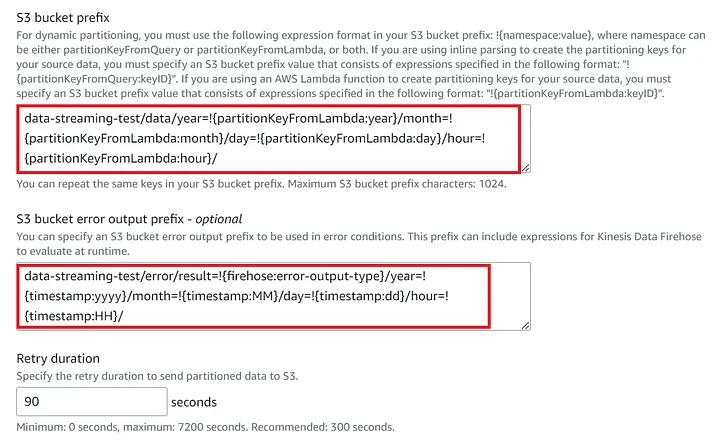
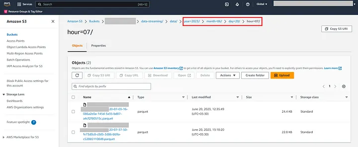

# Maximizing Data Efficiency with Amazon Kinesis Firehose Dynamic Partitioning

<br>


<br>

In the world of big data, managing and processing vast amounts of information efficiently is paramount. **Amazon Kinesis Firehose**, a powerful data streaming service, has revolutionized the way we handle data ingestion and transformation. One of its key features, **dynamic partitioning**, offers a strategic approach to enhance data storage and analysis. In this article, we’ll delve into the concept of dynamic partitioning, its benefits, and how it can optimize your data workflow.
<br>
<br>

|  | 
|:--:| 
| *Data flow from a data streaming service to Kinesis Firehose. It is transformed using AWS Lambda and then saved to S3. Data flow from a data stream application to AWS Kinesis Firehose. It is integrated with AWS Lambda, which is an optional step. After the Lambda sends back the data to Kinesis after applying transformation, the data is saved to AWS S3 with dynamic partitioning.* |

---

## Understanding Dynamic Partitioning
Imagine you’re dealing with a constant stream of data from multiple sources, each with distinct attributes. Dynamic partitioning is the process of automatically organizing this data into separate folders or partitions based on the values of certain attributes. These attributes could be timestamps, locations, or any other relevant parameters. Amazon Kinesis Firehose uses this technique to efficiently store data in Amazon S3, making it easier to manage and analyze.

---

## Benefits of Dynamic Partitioning
#### 1. Enhanced Query Performance
When data is stored in a well-structured manner using dynamic partitioning, it becomes significantly easier to retrieve specific subsets of data for analysis. Instead of scanning through the entire dataset, you can now narrow down your queries to specific partitions, improving query performance and reducing processing time. This targeted approach boosts overall system efficiency.

#### 2. Cost Optimization
Storing data can be costly, especially if you’re dealing with massive volumes. Dynamic partitioning optimizes storage costs by eliminating the need for redundant data. Since the data is partitioned based on its attributes, you only need to store unique values once. This not only reduces the storage footprint but also lowers data transfer costs.

#### 3. Simplified Data Management
Large datasets can quickly become unmanageable if not organized properly. Dynamic partitioning simplifies data management by logically grouping related data together. This structure makes it easier to implement data retention policies, track changes over time, and maintain data integrity.

#### 4. Scalability and Flexibility
As your data stream grows, so does the complexity of data management. Dynamic partitioning scales seamlessly to accommodate increasing data volumes. You can adapt the partitioning strategy based on evolving business requirements without major overhauls to your infrastructure.

---

## Implementing Dynamic Partitioning in Amazon Kinesis Firehose

<i>Amazon Kinesis Firehose makes it straightforward to implement dynamic partitioning:</i>

- **Define Partition Keys**: Choose the attributes that will serve as your partition keys. These attributes should have high cardinality to ensure effective data distribution.
- **Configure Delivery Streams**: While setting up your Firehose delivery stream, enable dynamic partitioning and specify the partition keys. This informs Firehose how to organize the incoming data.
- **Automated Data Distribution**: Firehose takes care of the rest. It dynamically creates folders and organizes data based on the partition keys you’ve defined.
- **Streamline Analysis**: When querying data in your storage destination (like Amazon S3), you can reference the partition keys to narrow down your search. This process accelerates data analysis and reduces resource consumption.
<br>
<br>

|  | 
|:--:| 
| *AWS Kinesis Firehose settings for dynamic partitioning using a custom AWS Lambda Function.* |

<br>

---

#### Below is a code snippet for a custom Lambda function for implementing dynamic partitioning:

```python
import base64
from datetime import datetime
import logging

logger = logging.getLogger(__name__)

def main(payload) -> str:
    '''Define a main() function to process data according to use-case and return a string output'''
    # TODO
    pass

def lambda_handler(event, context):
    output = []

    for record in event['records']:
        logger.info(f"Processing Record - {record['recordId']}")
        _payload = base64.b64decode(record['data']).decode('utf-8')
        _timestamp = datetime.fromtimestamp(int(record['approximateArrivalTimestamp'])/1000.0)
        partition_keys = {
                            "year": _timestamp.strftime('%Y'),
                            "month": _timestamp.strftime('%m'),
                            "day": _timestamp.strftime('%d'),
                            "hour": _timestamp.strftime('%H')
                        }
        output_record = {
            'recordId': record['recordId'],
            'result': 'Ok',
            'metadata': {'partitionKeys': partition_keys}
        }
        try:
            resp = main(_payload)
            output_record.update({'data': base64.b64encode(resp.encode('utf-8')).decode('utf-8')})
        except Exception:
            output_record.update({
                'result': 'ProcessingFailed',
                'data': base64.b64encode(_payload.encode('utf-8')).decode('utf-8')
            })
        output.append(output_record)

    return {'records': output}
```

<br>

#### Custom partitioning is done here with Lambda and output folder structure in AWS S3 is generated as below:

|  | 
|:--:| 
| *AWS S3 bucket containing data from AWS Kinesis Firehose and partitioned using Dynamic Partitioning.* |

---

## Conclusion
In the era of data-driven decision-making, the efficiency of data storage and analysis pipelines is paramount. Amazon Kinesis Firehose’s dynamic partitioning offers a powerful solution to streamline these processes, resulting in enhanced performance, cost savings, and simplified management. By embracing dynamic partitioning, organizations can ensure their data workflows are optimized for the challenges of today’s data landscape while being prepared for the data challenges of tomorrow.